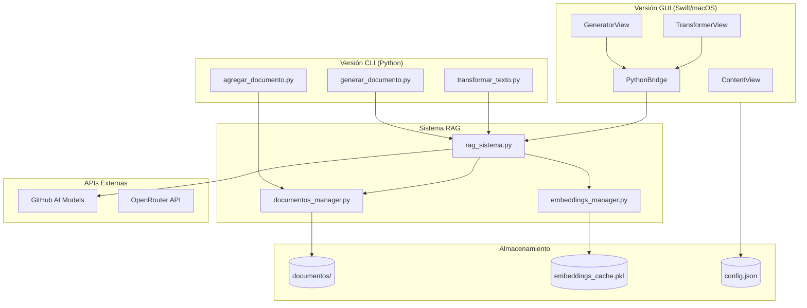
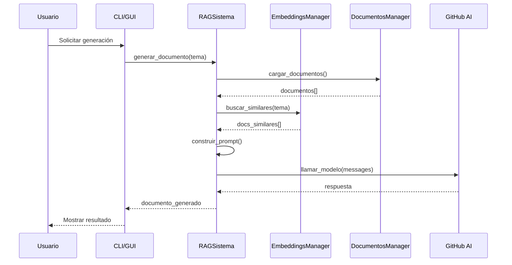

# MisDocumentosAI - Product Requirements Document (PRD)


---

## 1. Resumen Ejecutivo

**MisDocumentosAI** es un sistema de generación y transformación de documentos personalizados que utiliza técnicas de RAG (Retrieval-Augmented Generation) para imitar el estilo de escritura del usuario. El sistema aprende del estilo de escritura a partir de documentos de ejemplo y puede generar nuevos documentos o transformar textos existentes para que coincidan con ese estilo personal.

### Visión del Producto

Crear una herramienta accesible y potente que permita a estudiantes, profesionales y escritores generar documentos que mantengan su voz y estilo único, automatizando la redacción mientras preservan su identidad como autores.

---

## 2. Problema a Resolver

### Contexto

Los usuarios frecuentemente necesitan crear documentos con una estructura y estilo consistentes (prácticas académicas, reportes, ensayos, etc.). Mantener esta consistencia manualmente es tedioso y consume tiempo.

### Problemas Específicos

1. **Inconsistencia de estilo**: Documentos creados por el mismo autor varían en tono y estructura
2. **Tiempo de redacción**: Crear documentos estructurados desde cero es lento
3. **Pérdida de voz personal**: Las herramientas de IA genéricas producen texto genérico
4. **Curva de aprendizaje**: Herramientas complejas requieren configuración extensiva

### Solución

Un sistema RAG que:
- Aprende del estilo de escritura del usuario a partir de documentos de ejemplo
- Genera documentos nuevos manteniendo ese estilo
- Transforma textos externos al estilo personal del usuario
- Ofrece interfaces CLI y GUI para diferentes preferencias de usuario

---

## 3. Usuarios Objetivo

| Segmento | Descripción | Necesidad Principal |
|----------|-------------|---------------------|
| **Estudiantes** | Universitarios que necesitan crear prácticas, ensayos e investigaciones | Mantener consistencia en trabajos académicos |
| **Profesionales** | Personas que redactan reportes, manuales o documentación | Automatizar documentación técnica |
| **Escritores** | Autores que buscan mantener voz consistente | Preservar estilo personal en borradores |
| **Desarrolladores** | Usuarios técnicos que prefieren herramientas CLI | Integración en workflows automatizados |

---

## 4. Alcance del Producto

### 4.1 Versión CLI (Command Line Interface)

**Tecnología:** Python 3.8+

#### Funcionalidades

| Módulo | Descripción | Comando |
|--------|-------------|---------|
| **Generador** | Crear documentos nuevos desde un tema | `python generar_documento.py "tema"` |
| **Transformador** | Adaptar textos al estilo del usuario | `python transformar_texto.py --archivo texto.txt` |
| **Agregador** | Añadir documentos de ejemplo al sistema | `python agregar_documento.py documento.txt` |

#### Parámetros de Generación

```bash
# Parámetros disponibles
--tipo          # Tipo de documento (practica, investigacion, ensayo, etc.)
--contexto      # Archivo con contexto adicional
--contexto-texto # Texto directo como contexto
--prompt        # Prompt personalizado desde archivo
--prompt-texto  # Prompt personalizado directo
--endpoint      # Endpoint de API personalizado
--temperatura   # Control de creatividad (0.0-1.0)
--max-tokens    # Longitud máxima (hasta 32768)
--top-p         # Nucleus sampling (0.0-1.0)
--frequency-penalty # Penalización de frecuencia (-2.0 a 2.0)
--presence-penalty  # Penalización de presencia (-2.0 a 2.0)
--guardar       # Guardar documento generado
```

---

### 4.2 Versión GUI (Graphical User Interface)

**Tecnología:** SwiftUI para macOS 14+

#### Interfaz

```
┌─────────────────────────────────────────────────────────────────┐
│ MisDocumentosAI                                                 │
├──────────┬──────────────────────────┬──────────────────────────┤
│          │                          │                          │
│  SIDEBAR │     LISTA/EDITOR        │    DETALLE/PREVIEW       │
│          │                          │                          │
│ • Docs   │  Documentos disponibles  │  Vista previa del doc    │
│ • Generar│  Editor de generación    │  Resultado generado      │
│ • Trans- │  Editor de transform     │  Texto transformado      │
│   formar │                          │                          │
├──────────┴──────────────────────────┴──────────────────────────┤
│ Configuración | Token de API | Modelos                         │
└─────────────────────────────────────────────────────────────────┘
```

#### Secciones

| Sección | Funcionalidad |
|---------|--------------|
| **Documentos** | Gestión de documentos de ejemplo, visualización en lista y detalle |
| **Generador** | Interfaz gráfica para generar documentos con controles visuales |
| **Transformador** | Editor de texto para transformar documentos al estilo del usuario |
| **Configuración** | Gestión de API keys, endpoints y parámetros por defecto |

---

## 5. Arquitectura del Sistema

### 5.1 Diagrama de Componentes



### 5.2 Flujo de Datos



---

## 6. Requisitos Técnicos

### 6.1 Versión CLI

| Requisito | Especificación |
|-----------|---------------|
| **Python** | 3.8 o superior |
| **Dependencias** | `requests`, `numpy`, `scikit-learn` |
| **API Key** | Variable de entorno `GITHUB_TOKEN` |
| **Storage** | Directorio local `documentos/` |

### 6.2 Versión GUI

| Requisito | Especificación |
|-----------|---------------|
| **macOS** | 14.0 (Sonoma) o superior |
| **Swift** | 5.9 o superior |
| **Xcode** | 15.0 o superior |
| **Python** | 3.8+ (requerido para PythonBridge) |

---

## 7. Compatibilidad de Sistemas Operativos

### Matriz de Compatibilidad

| Sistema Operativo | CLI (Python) | GUI (SwiftUI) | Notas |
|-------------------|:------------:|:-------------:|-------|
| **macOS 14+ (Sonoma)** | ✅ Completo | ✅ Completo | Soporte nativo completo |
| **macOS 13 (Ventura)** | ✅ Completo | ⚠️ Parcial | GUI requiere macOS 14+ |
| **macOS 12 (Monterey)** | ✅ Completo | ❌ No soportado | Solo CLI |
| **Windows 10/11** | ✅ Completo | ❌ No disponible | Solo CLI |
| **Linux (Ubuntu 20.04+)** | ✅ Completo | ❌ No disponible | Solo CLI |
| **WSL2** | ✅ Completo | ❌ No disponible | Solo CLI |

### Requisitos por Plataforma

#### macOS (GUI & CLI)
```bash
# Requisitos mínimos
- macOS 14.0+ para GUI
- Python 3.8+ para CLI
- Xcode 15+ para compilar GUI
- 4GB RAM mínimo
- 500MB espacio en disco
```

#### Windows (Solo CLI)
```bash
# Requisitos
- Windows 10/11
- Python 3.8+
- pip para gestión de dependencias
- PowerShell o CMD
```

#### Linux (Solo CLI)
```bash
# Requisitos
- Ubuntu 20.04+ / Debian 11+ / Fedora 35+
- Python 3.8+
- pip3
- Conexión a internet para APIs
```

---

## 8. APIs y Modelos Soportados

### Proveedores de IA

| Proveedor | Endpoint | Modelos Disponibles |
|-----------|----------|---------------------|
| **GitHub AI** | `https://models.github.ai/inference` | GPT-4.1, GPT-4o |
| **OpenRouter** | Configurable | Múltiples modelos |

### Parámetros del Modelo

| Parámetro | Rango | Default | Descripción |
|-----------|-------|---------|-------------|
| `temperatura` | 0.0 - 1.0 | 0.7 | Creatividad de respuestas |
| `max_tokens` | 1 - 32768 | 32768 | Longitud máxima |
| `top_p` | 0.0 - 1.0 | 1.0 | Nucleus sampling |
| `frequency_penalty` | -2.0 - 2.0 | 0.0 | Evitar repeticiones |
| `presence_penalty` | -2.0 - 2.0 | 0.0 | Favorecer nuevos temas |

---

## 9. Estructura de Documentos

### Formato JSON

```json
{
  "id": "documento_ejemplo.json",
  "titulo": "Título del Documento",
  "tipo": "practica | investigacion | ensayo | reporte | manual",
  "materia": "Nombre de la materia",
  "presenta": "Nombre del autor",
  "profesor": "Nombre del profesor",
  "introduccion": "Texto de introducción...",
  "desarrollo": "Contenido principal...",
  "conclusion": "Conclusiones finales..."
}
```

### Tipos de Documento Soportados

| Tipo | Icono | Uso Típico |
|------|-------|------------|
| `practica` | 🔨 | Trabajos prácticos de laboratorio |
| `investigacion` | 🔍 | Trabajos de investigación |
| `ensayo` | 📝 | Ensayos argumentativos |
| `reporte` | 📊 | Reportes técnicos |
| `manual` | 📖 | Documentación y manuales |
| `otro` | 📄 | Otros tipos de documento |

---

## 10. Sistema RAG (Retrieval-Augmented Generation)

### Funcionamiento

1. **Indexación**: Los documentos del usuario se cargan y se generan embeddings
2. **Recuperación**: Para cada consulta, se buscan los documentos más similares
3. **Generación**: Se construye un prompt con ejemplos y se envía al modelo
4. **Post-procesamiento**: La respuesta se formatea según la estructura esperada

### Embeddings

| Característica | Valor |
|----------------|-------|
| Dimensión | 1536 |
| Modelo | text-embedding-ada-002 (con fallback local) |
| Caché | `embeddings_cache.pkl` |
| Similitud | Coseno |

---

## 11. Roadmap

### Fase 1: MVP ✅
- [x] Generador de documentos CLI
- [x] Transformador de texto CLI
- [x] Sistema RAG básico
- [x] Aplicación GUI macOS

### Fase 2: Mejoras (En progreso)
- [ ] Soporte multi-idioma
- [ ] Exportación a DOCX/PDF
- [ ] Historial de generaciones
- [ ] Templates personalizables

### Fase 3: Expansión (Futuro)
- [ ] Versión iOS/iPadOS
- [ ] API REST para integración
- [ ] Entrenamiento de embeddings local
- [ ] Modo offline con modelos locales

---

## 12. Métricas de Éxito

| Métrica | Objetivo | Medición |
|---------|----------|----------|
| **Tiempo de generación** | < 30 segundos | Promedio por documento |
| **Similitud de estilo** | > 85% | Evaluación por usuario |
| **Adopción** | 100+ usuarios | Descargas/clones |
| **Satisfacción** | > 4.5/5 | Feedback de usuarios |

---

## 13. Consideraciones de Seguridad

### Almacenamiento de Credenciales

| Método | CLI | GUI |
|--------|-----|-----|
| Variables de entorno | ✅ `GITHUB_TOKEN` | ✅ Soportado |
| Keychain (macOS) | ❌ | ✅ KeychainService |
| Archivo de configuración | ❌ | ✅ config.json (encriptado) |

### Privacidad de Datos

- Los documentos se almacenan localmente
- Los embeddings se generan y cachean localmente
- Solo el prompt y contexto se envían a la API
- No se recopilan datos de uso

---

## 14. Licencia y Atribución

Este proyecto está bajo la licencia **MIT**.

```
Copyright (c) 2025 Leonardo Cruz

Permission is hereby granted, free of charge, to any person obtaining a copy
of this software and associated documentation files (the "Software"), to deal
in the Software without restriction, including without limitation the rights
to use, copy, modify, merge, publish, distribute, sublicense, and/or sell
copies of the Software...
```

---

*Documento generado: Diciembre 2025*
*Última actualización: 19 de Diciembre de 2025*
